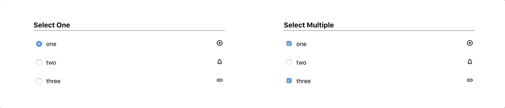

# Compound Component Pattern

---

This is a side by side demonstration of how Compound Component Patterns help write clean abstractions for React Components.

## What is Compound Component Pattern

A pattern that enables to write React abstractions with a minimal api surface area. Following this pattern removes the need for configuring props for all state and data variations that
the components can have.
A compound component encloses the state and behavior for a group of components but may give the rendering control for its variable parts back to the external user. The way it is done
is by sharing implicit state between the components involved.

## Demo

The example here is of a Selectable list which can be toggled to support either single or multiple selection.



## API

### Single Selection

```javascript
<List label="Select One" initialValues={1} onSelection={v => console.log(v)}>
  <List.Item value={1} icon="add_circle_outline">one</List.Item>
  <List.Item value={2} icon="notifications_none">two</List.Item>
  <List.Item value={3} icon="link">three</List.Item>
</List>
```

### Multi Selection

```javascript
<List multi label="Select Multiple" initialValues={[1, 3]} onSelection={v => console.log(v)}>
  <List.Item value={1} icon="add_circle_outline">one</List.Item>
  <List.Item value={2} icon="notifications_none">two</List.Item>
  <List.Item value={3} icon="link">three</List.Item>
</List>
```
